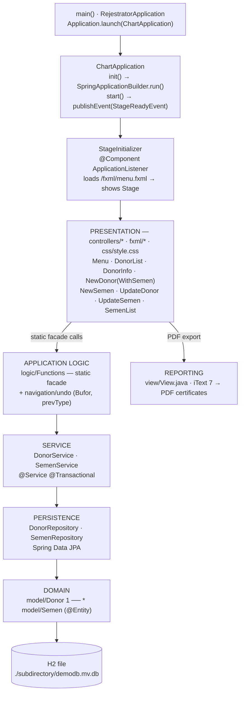
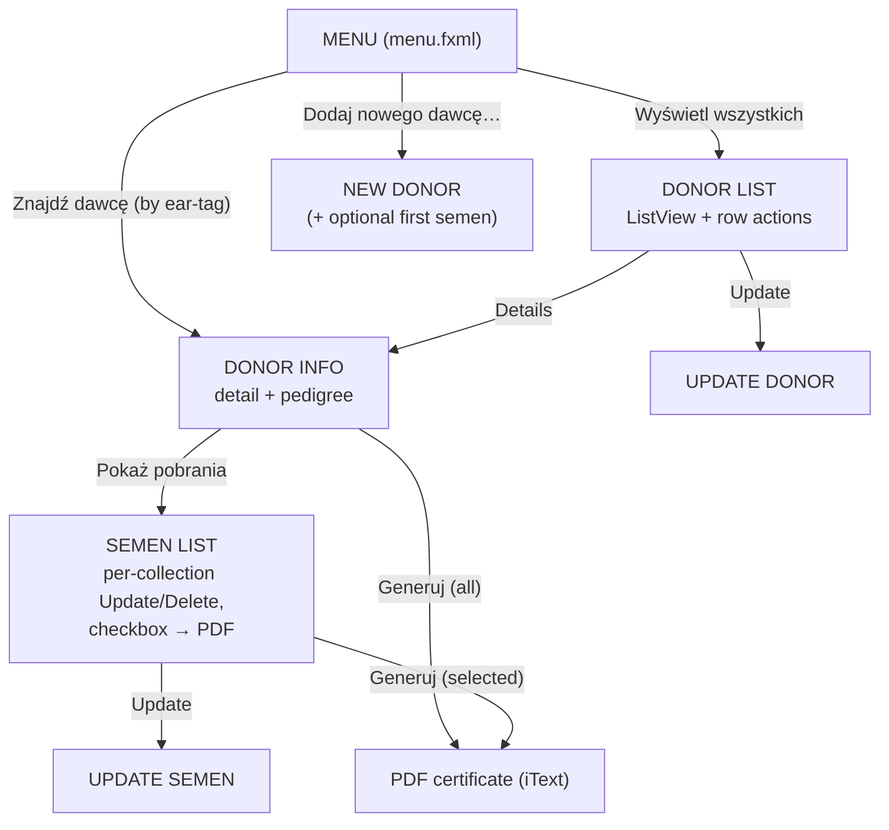
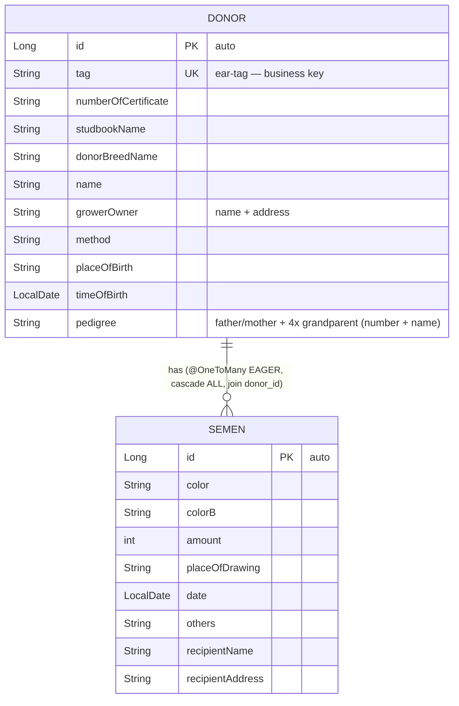

# 🐂 Rejestrator — Cattle Semen-Donor Registry

> A **Spring Boot + JavaFX** desktop application for registering bull (cattle) semen
> **donors**, recording their **semen collections**, tracking full **pedigree** data, and
> exporting official-style **PDF breeding certificates** — all backed by an embedded,
> file-based H2 database with no server or network component.

<p>
  
  
  
  
  
  
  
  
</p>

> ℹ️ **Language note:** The user interface, alert dialogs and PDF headings are in **Polish**
> throughout (`Rejestrator` = *Registrar*). Class names, methods and the rest of the codebase
> are in English. A few labels and comments contain Polish slang.

---

## Table of Contents

1. [Purpose](#-purpose)
2. [Main Features](#-main-features)
3. [Tech Stack](#-tech-stack)
4. [Architecture](#-architecture)
5. [Application Workflow](#-application-workflow)
6. [Domain Model](#-domain-model)
7. [Quickstart](#-quickstart)
8. [Project Layout](#-project-layout)
9. [Configuration](#-configuration)
10. [Known Limitations](#-known-limitations)

---

## 🎯 Purpose

**Rejestrator** (Polish for *"Registrar"*) is a single-user Windows desktop tool built for the
animal-husbandry / cattle-breeding domain. It digitises the paperwork around **artificial
insemination**: each **donor** is a pedigree bull, and each donor has zero or more **semen
collections** (*"pobrania"*) describing the straws produced (colour code, quantity, drawing
place/date, recipient).

The application lets an operator:

- catalogue donor bulls together with their **three-generation pedigree** (parents + four
  grandparents),
- attach and manage **semen-collection** records per donor,
- browse, search (by ear-tag), edit and delete records,
- generate **PDF certificates** matching the layout of Polish breeding documents (studbook
  number, pedigree table, collection tables).

All data is stored locally in an embedded **H2 file database**; no server or network component
is required.

---

## ✨ Main Features

| # | Feature | Where it lives |
|---|---------|----------------|
| 1 | **Add donor** (identity + pedigree only) | `NewDonorController` + `newDonor.fxml` |
| 2 | **Add donor with first semen collection** in one form | `NewDonorWithSemenController` + `newDonorWithSemen.fxml` |
| 3 | **List all donors** in a rich `ListView` with per-row *Details / Update / Delete* buttons | `DonorListController` + `donorList.fxml` |
| 4 | **Find donor by ear-tag** (*"kolczyk"*) | `MenuController.findDonor` |
| 5 | **View donor detail** including full pedigree | `DonorInfoController` + `donorInfo.fxml` |
| 6 | **Add / update / delete semen collections** for a donor | `NewSemenController`, `UpdateSemenController`, `SemenListController` |
| 7 | **Update donor** record | `UpdateDonorController` + `updateDonor.fxml` |
| 8 | **Generate PDF** — either *all* collections for a donor, or a *selected subset* chosen via checkboxes | `view/View.java` (iText 7) |
| 9 | **Keyboard-driven data entry** — `ENTER` advances focus field-to-field; empty fields are highlighted red on validation | `initialize()` in the form controllers |
| 10 | **Multi-window navigation with a "back" stack** | `logic/Functions.undoFunction` + `controllers/Bufor` + `enums/prevType` |
| 11 | **Persistent local storage** across runs | H2 file DB at `./subdirectory/demodb` |

---

## 🧰 Tech Stack

### Languages & Runtime
| Technology | Version | Role |
|-----------|---------|------|
| **Java** | 17 | Primary language |
| **Maven** | via wrapper (`mvnw`) | Build & dependency management |

### Frameworks & Libraries
| Library | Version | Purpose | Actually used? |
|---------|---------|---------|----------------|
| **Spring Boot** (starter-parent) | 2.6.0 | Application container / bean wiring / config | ✅ |
| **Spring Boot Data JPA** | 2.6.2 | ORM repositories (`JpaRepository`) | ✅ |
| **Hibernate** (via Spring) | (managed) | JPA provider | ✅ |
| **JavaFX** (controls, fxml, graphics, media) | 17.0.1 | Desktop GUI + FXML views | ✅ |
| **H2 Database** | 2.1.210 | Embedded file-based DB | ✅ (runtime) |
| **iText 7** (kernel, layout, itext7-core) | 7.2.0 | PDF certificate generation | ✅ |
| **Google Guava** | 31.0.1-jre | `EventBus` import in `StageInitializer` | ⚠️ imported, barely used |
| **Spring Web** | 5.3.15 | Pulled in as a dependency | ⚠️ no web layer exists |
| **Spring Boot DevTools** | 2.6.2 | Hot reload during dev | ✅ (dev) |
| **MySQL Connector/J** | (managed) | JDBC driver | ❌ declared but **unused** (H2 is the real DB) |
| **JUnit 5** (spring-boot-starter-test) | 2.6.2 | Testing | ⚠️ only a default `contextLoads()` test |

### Tooling
- **Scene Builder** — the FXML files carry the Gluon Scene Builder license header, indicating the
  UI was laid out visually.
- **Maven Wrapper** (`.mvn/wrapper`) — reproducible Maven version.

---

## 🏛 Architecture

The project follows a **layered (n-tier) architecture** and uses the well-known **Spring Boot +
JavaFX bootstrap bridge** so that JavaFX controllers can (in principle) obtain Spring-managed
beans.



**Package responsibilities**

| Package | Responsibility |
|---------|----------------|
| `com.example.Rejestrator` | App bootstrap + JavaFX/Spring bridge (`RejestratorApplication`, `ChartApplication`, `StageInitializer`) |
| `.controllers` | JavaFX view controllers (one per FXML) + `Bufor` navigation state holder |
| `.model` | JPA entities `Donor`, `Semen` |
| `.repository` | Spring Data `JpaRepository` interfaces |
| `.service` | Transactional business operations |
| `.logic` | `Functions` — a **static facade** the controllers call into |
| `.view` | `View` — iText PDF generation |
| `.info` | `Alerts` — centralised JavaFX dialog factory |
| `.enums` | `prevType` — navigation breadcrumb enum |

> **Design note:** the intended integration pattern (Spring owns the beans, JavaFX owns the UI)
> is only *partially* realised. Most controllers are instantiated by JavaFX's `FXMLLoader` (not
> by Spring) and reach the service layer through the `Functions` static facade, which pulls
> beans out of a static `ApplicationContext`.

---

## 🔄 Application Workflow



**Navigation / "undo" mechanism.** Because every screen opens a brand-new `Stage`, the app keeps
a lightweight breadcrumb in a `Bufor` object (`prev`, `prevPrev`, and the current `Donor`).
`Functions.undoFunction(...)` reads the `prevType` enum and re-loads the correct previous FXML — a
hand-rolled back-stack.

**Typical "add + certify" path**

1. `MENU → Dodaj nowego dawcę z pobraniem` → fill donor + first collection → save.
2. `MENU → Znajdź dawcę` → type ear-tag → **DONOR INFO**.
3. `DONOR INFO → Pokaż pobrania` → **SEMEN LIST** → tick the collections to include.
4. `Generuj` → iText writes `Rejestrator - Pliki PDF/dawcy/<tag>.pdf`.

---

## 🗃 Domain Model

A single unidirectional one-to-many relationship: one `Donor` owns many `Semen` collections.



- **Identity:** the business key is the ear-tag (`tag`), enforced in code via `existsDonorByTag`
  before insert (there is no DB-level unique constraint — the `@Unique` annotation used is the
  Checker Framework's, **not** a JPA constraint).
- **Sorting:** `Semen implements Comparable<Semen>` (sorts by date desc, then colour), so a
  donor's collections render newest-first.

---

## 🚀 Quickstart

### Prerequisites
- **JDK 17** (the `pom.xml` targets `java.version=17`).
- Windows is assumed by the code (PDF output path uses `\\` separators).
- No external database — H2 runs embedded and creates its files on first launch.

### Run from source (recommended)
```bash
# from the repository root
cd Rejestrator

# Windows
mvnw.cmd clean spring-boot:run

# Linux / macOS
./mvnw clean spring-boot:run
```
The JavaFX dependencies are declared in `pom.xml`, so `spring-boot:run` launches the GUI
directly. A window titled **Menu / REJESTRATOR** should appear.

> **Run from the `Rejestrator/` directory.** The app resolves its H2 database at
> `./subdirectory/demodb` and writes PDFs to `./Rejestrator - Pliki PDF/` **relative to the
> working directory**, so launching elsewhere splits your data.

### Build a JAR
```bash
cd Rejestrator
./mvnw clean package
# produces target/Rejestrator-0.0.1-SNAPSHOT.jar
```
> Note: a pre-built `Rejestrator.jar` (~61 MB) is committed at the repo root. Prefer building
> fresh — binaries generally should not live in source control.

### Output locations (created at runtime)
| Path | Contents |
|------|----------|
| `Rejestrator/subdirectory/demodb.mv.db` | H2 database |
| `Rejestrator/Rejestrator - Pliki PDF/dawcy/<tag>.pdf` | selected-collections certificate |
| `Rejestrator/Rejestrator - Pliki PDF/dawcy_wszystkie_pobrania/<tag>.pdf` | all-collections certificate |

---

## 📁 Project Layout

```
Cattle-Registrar-main/
└─ Rejestrator/                    ← the Maven module (the actual app)
   ├─ pom.xml
   ├─ mvnw / mvnw.cmd / .mvn/      ← Maven wrapper
   ├─ Rejestrator.jar             ← ⚠️ committed 61 MB build artifact
   ├─ subdirectory/               ← ⚠️ committed H2 DB (incl. .trace.db log)
   ├─ Rejestrator - Pliki PDF/    ← ⚠️ committed sample PDF outputs
   └─ src/
      ├─ main/
      │  ├─ java/com/example/Rejestrator/
      │  │  ├─ RejestratorApplication.java   ChartApplication.java   StageInitializer.java
      │  │  ├─ controllers/   (9 controllers + Bufor)
      │  │  ├─ model/         (Donor, Semen)
      │  │  ├─ repository/    (DonorRepository, SemenRepository)
      │  │  ├─ service/       (DonorService, SemenService)
      │  │  ├─ logic/         (Functions)
      │  │  ├─ view/          (View — PDF)
      │  │  ├─ info/          (Alerts)
      │  │  └─ enums/         (prevType)
      │  └─ resources/
      │     ├─ application.properties
      │     ├─ fxml/          (9 FXML views)
      │     └─ css/style.css
      └─ test/java/.../RejestratorApplicationTests.java   (contextLoads only)
```

---

## ⚙️ Configuration

`src/main/resources/application.properties`:

```properties
spring.datasource.username=sa
spring.datasource.password=password
spring.datasource.driverClassName=org.h2.Driver
spring.jpa.hibernate.ddl-auto=update
spring.jpa.database-platform=org.hibernate.dialect.H2Dialect
spring.datasource.url=jdbc:h2:file:./subdirectory/demodb
```

- **`ddl-auto=update`** — Hibernate creates/updates the schema from the entities on startup, so
  no manual migrations are needed.
- **File-mode H2** persists data between runs.
- The file also contains a stray, meaningless first line
  (`spring.main.web-application.demo.stockui`) and a commented in-memory URL — leftovers that
  should be removed.

---

## ⚠️ Known Limitations

- **Windows-only** PDF paths (hardcoded `\\` separators) despite an "unsupported OS" alert
  existing in code.
- **"Update = delete + re-insert"** in the service layer, which regenerates the auto-ID and is not
  safe for the `@OneToMany` graph.
- A **broken resource path** (`/fxml1/donorInfo.fxml`) in the update-donor flow.
- Several **copy-paste field bugs** (e.g. owner address populated from grower address; a year field
  overwritten by the certificate number).
- **No meaningful tests** and **build/DB artifacts committed** to version control.
- **Polish-language profanity and slang** in a few comments and identifiers.
